# Individual Specialized Agent Mini-Workflows

This diagram shows the detailed mini-workflows for each of the four specialized health data agents.

## Agent Operations

Each specialized agent supports four core operations:
- **Extract**: Parse and structure data from OCR text
- **Store**: Save structured data to appropriate database tables  
- **Retrieve**: Fetch relevant data based on intelligent assessment
- **Assess**: Evaluate question relevance and determine retrieval strategy

```mermaid
graph TD
    %% Individual Specialized Agent Mini-Workflows
    
    %% Vitals Agent Workflow
    subgraph "💓 Vitals Agent Mini-Workflow"
        V_Start([Vitals Request]) --> V_Initialize[🔧 Initialize Agent State]
        V_Initialize --> V_Route{🎯 Route Operation}
        
        %% Extract Path
        V_Route -->|Extract| V_Extract[📊 Extract Vital Signs<br/>Blood pressure, heart rate<br/>Temperature, weight, height<br/>Blood sugar, oxygen saturation<br/>BMI calculations]
        
        %% Store Path  
        V_Route -->|Store| V_Store[💾 Store Vitals Data<br/>Convert units to standard<br/>Validate against ranges<br/>Set confidence scores<br/>Link to user profile]
        
        %% Retrieve Path
        V_Route -->|Retrieve| V_Retrieve[📋 Retrieve Vitals Data<br/>Query by date range<br/>Filter by vital type<br/>Calculate trends<br/>Generate insights]
        
        %% Assessment Path
        V_Route -->|Assess| V_Assess[🧠 Assess Question Relevance<br/>LLM analysis of question<br/>Identify vital signs mentioned<br/>Determine time sensitivity<br/>Score relevance 0.0-1.0]
        
        V_Extract --> V_Analyze[📈 Analyze Extracted Data<br/>Validate measurements<br/>Check against norms<br/>Calculate derived metrics]
        
        V_Store --> V_Trends[📊 Calculate Trends<br/>Blood pressure trends<br/>Weight changes<br/>Heart rate patterns]
        
        V_Retrieve --> V_Format[📋 Format Retrieved Data<br/>Latest measurements<br/>Historical trends<br/>Health insights]
        
        V_Assess --> V_Strategy[🎯 Determine Strategy<br/>Days back: 7-365<br/>Data limit: 5-50 records<br/>Priority data focus]
        
        V_Analyze --> V_Finalize[✅ Finalize Response]
        V_Trends --> V_Finalize
        V_Format --> V_Finalize
        V_Strategy --> V_Finalize
        
        V_Finalize --> V_End([Vitals Complete])
    end
    
    %% Pharmacy Agent Workflow
    subgraph "💊 Pharmacy Agent Mini-Workflow"
        P_Start([Pharmacy Request]) --> P_Initialize[🔧 Initialize Agent State]
        P_Initialize --> P_Route{🎯 Route Operation}
        
        P_Route -->|Extract| P_Extract[📊 Extract Pharmacy Data<br/>Pharmacy name and location<br/>Medication names and quantities<br/>Pricing and insurance info<br/>Prescriber information]
        
        P_Route -->|Store| P_Store[💾 Store Pharmacy Data<br/>Create pharmacy bill record<br/>Store individual medications<br/>Link medications to bills<br/>Track prescriber info]
        
        P_Route -->|Retrieve| P_Retrieve[📋 Retrieve Pharmacy Data<br/>Query bills by date range<br/>Calculate spending patterns<br/>Analyze usage frequency<br/>Generate cost insights]
        
        P_Route -->|Assess| P_Assess[🧠 Assess Question Relevance<br/>Evaluate cost-related queries<br/>Check medication mentions<br/>Assess pharmacy preferences<br/>Score relevance]
        
        P_Extract --> P_ParseMeds[💊 Parse Medications<br/>Extract drug names<br/>Identify generic vs brand<br/>Parse dosages and quantities]
        
        P_Store --> P_LinkData[🔗 Link Related Data<br/>Connect meds to bills<br/>Track refill patterns<br/>Update spending totals]
        
        P_Retrieve --> P_AnalyzeSpending[💰 Analyze Spending<br/>Total costs by period<br/>Most expensive medications<br/>Pharmacy usage patterns]
        
        P_Assess --> P_DetermineScope[🎯 Determine Retrieval Scope<br/>Recent purchases vs trends<br/>Cost focus vs medication focus<br/>Time range selection]
        
        P_ParseMeds --> P_Finalize[✅ Finalize Response]
        P_LinkData --> P_Finalize
        P_AnalyzeSpending --> P_Finalize
        P_DetermineScope --> P_Finalize
        
        P_Finalize --> P_End([Pharmacy Complete])
    end
    
    %% Lab Agent Workflow
    subgraph "🧪 Lab Agent Mini-Workflow"
        L_Start([Lab Request]) --> L_Initialize[🔧 Initialize Agent State]
        L_Initialize --> L_Route{🎯 Route Operation}
        
        L_Route -->|Extract| L_Extract[📊 Extract Lab Data<br/>Test names and categories<br/>Result values and units<br/>Reference ranges<br/>Lab facility information]
        
        L_Route -->|Store| L_Store[💾 Store Lab Data<br/>Create individual test records<br/>Categorize by test type<br/>Store reference ranges<br/>Flag abnormal results]
        
        L_Route -->|Retrieve| L_Retrieve[📋 Retrieve Lab Data<br/>Query by test category<br/>Identify abnormal results<br/>Calculate trends<br/>Generate analysis]
        
        L_Route -->|Assess| L_Assess[🧠 Assess Question Relevance<br/>Identify test types mentioned<br/>Evaluate diagnostic relevance<br/>Determine retrieval focus<br/>Score relevance]
        
        L_Extract --> L_ParseTests[🧪 Parse Individual Tests<br/>Extract test names<br/>Parse numeric values<br/>Determine test status]
        
        L_Store --> L_CategorizeTests[📋 Categorize Tests<br/>Blood tests, urine tests<br/>Chemistry panels<br/>Organ function tests]
        
        L_Retrieve --> L_AnalyzeResults[📈 Analyze Results<br/>Identify abnormal patterns<br/>Calculate test trends<br/>Flag concerning results]
        
        L_Assess --> L_FocusStrategy[🎯 Focus Strategy<br/>Recent results vs trends<br/>Specific test categories<br/>Time range optimization]
        
        L_ParseTests --> L_Finalize[✅ Finalize Response]
        L_CategorizeTests --> L_Finalize
        L_AnalyzeResults --> L_Finalize
        L_FocusStrategy --> L_Finalize
        
        L_Finalize --> L_End([Lab Complete])
    end
    
    %% Prescription Agent Workflow
    subgraph "📝 Prescription Agent Mini-Workflow"
        R_Start([Prescription Request]) --> R_Initialize[🔧 Initialize Agent State]
        R_Initialize --> R_Route{🎯 Route Operation}
        
        R_Route -->|Extract| R_Extract[📊 Extract Prescription Data<br/>Medication names and generics<br/>Dosages and frequencies<br/>Prescribing physician<br/>Duration and refills]
        
        R_Route -->|Store| R_Store[💾 Store Prescription Data<br/>Create prescription records<br/>Link to user sessions<br/>Store dosage instructions<br/>Record prescription dates]
        
        R_Route -->|Retrieve| R_Retrieve[📋 Retrieve Prescription Data<br/>Query by medication name<br/>Track dosage changes<br/>Analyze prescription patterns<br/>Generate medication history]
        
        R_Route -->|Assess| R_Assess[🧠 Assess Question Relevance<br/>Identify medication mentions<br/>Check for dosage questions<br/>Assess medication history needs<br/>Score relevance]
        
        R_Extract --> R_ParseMedications[💊 Parse Medications<br/>Extract drug names<br/>Parse dosage instructions<br/>Extract refill information]
        
        R_Store --> R_TrackHistory[📝 Track Medication History<br/>Link to previous prescriptions<br/>Track dosage changes<br/>Monitor prescriber patterns]
        
        R_Retrieve --> R_AnalyzePatterns[📊 Analyze Prescription Patterns<br/>Medication adherence trends<br/>Dosage change history<br/>Drug interaction potential]
        
        R_Assess --> R_DetermineFocus[🎯 Determine Focus<br/>Current medications vs history<br/>Specific drug classes<br/>Dosage change tracking]
        
        R_ParseMedications --> R_Finalize[✅ Finalize Response]
        R_TrackHistory --> R_Finalize
        R_AnalyzePatterns --> R_Finalize
        R_DetermineFocus --> R_Finalize
        
        R_Finalize --> R_End([Prescription Complete])
    end
    
    %% Styling
    classDef startEnd fill:#e3f2fd
    classDef route fill:#fff3e0
    classDef extract fill:#e8f5e8
    classDef store fill:#f3e5f5
    classDef retrieve fill:#e1f5fe
    classDef assess fill:#f1f8e9
    classDef process fill:#fce4ec
    classDef finalize fill:#e0f2f1
    
    class V_Start,V_End,P_Start,P_End,L_Start,L_End,R_Start,R_End startEnd
    class V_Route,P_Route,L_Route,R_Route route
    class V_Extract,P_Extract,L_Extract,R_Extract extract
    class V_Store,P_Store,L_Store,R_Store store
    class V_Retrieve,P_Retrieve,L_Retrieve,R_Retrieve retrieve
    class V_Assess,P_Assess,L_Assess,R_Assess assess
    class V_Analyze,P_ParseMeds,L_ParseTests,R_ParseMedications,V_Trends,P_LinkData,L_CategorizeTests,R_TrackHistory process
    class V_Finalize,P_Finalize,L_Finalize,R_Finalize finalize
```

## Agent Specializations

### 💓 Vitals Agent
**Focus**: Blood pressure, heart rate, temperature, weight, BMI, blood sugar, oxygen saturation
**Intelligence**: Determines if trends or recent readings are needed, optimal time ranges for different vital types

### 💊 Pharmacy Agent  
**Focus**: Pharmacy bills, medication purchases, costs, spending patterns, pharmacy preferences
**Intelligence**: Distinguishes between cost analysis and medication tracking questions, spending vs usage focus

### 🧪 Lab Agent
**Focus**: Laboratory tests, diagnostic results, reference ranges, abnormal findings, test trends
**Intelligence**: Identifies relevant test categories, prioritizes abnormal results, determines trend analysis needs

### 📝 Prescription Agent
**Focus**: Prescribed medications, dosages, prescribers, medication history, dosage changes
**Intelligence**: Distinguishes current medications from historical patterns, tracks medication adherence and changes 