# Document Upload Workflow in Chat Sessions

This diagram shows the complete document upload workflow from the chat interface through the multi-agent processing system to final data storage and response generation.

## Workflow Overview

The document upload workflow integrates seamlessly with chat sessions, providing intelligent document processing through specialized health data agents. The system uses LangGraph for workflow orchestration and state management.

```mermaid
graph TD
    %% Document Upload Agent Workflow in Chat Session
    
    subgraph "📱 Frontend Chat Interface"
        User[👤 User] --> ChatUI[💬 Chat Interface]
        ChatUI --> FileUpload[📎 File Upload + Message]
        FileUpload --> FormData[📋 FormData<br/>content: user message<br/>file: uploaded file<br/>session_id]
    end
    
    subgraph "🌐 API Layer"
        FormData --> ChatAPI[🔗 POST chat-sessions upload]
        ChatAPI --> FileValidation[✅ File Validation<br/>Check file type<br/>Generate unique filename<br/>Save to uploads directory]
        FileValidation --> CreateUserMsg[�� Create User Message<br/>Store in chat_messages table<br/>Include file_path and file_type]
    end
    
    subgraph "🤖 Enhanced Customer Agent Workflow"
        CreateUserMsg --> CustomerAgent[🎯 Enhanced Customer Agent Entry Point]
        CustomerAgent --> GuardrailsValidation[🛡️ Guardrails Validation<br/>Skip for file-only uploads<br/>Validate actual user messages<br/>Filter harmful content]
        
        GuardrailsValidation --> AnalyzeRequest[🔍 Analyze Request Node<br/>Classify intent with AI<br/>Determine request type<br/>Generate session title]
        
        AnalyzeRequest --> RequestType{🎯 Request Type Classification}
        
        RequestType -->|file_only| FileProcessing[📄 Process File Node]
        RequestType -->|file_and_question| FileProcessing
        RequestType -->|question_only| MedicalDoctor[👨‍⚕️ Medical Doctor Agent]
        RequestType -->|data_update| DataUpdate[📝 Data Update Processing]
        
        FileProcessing --> DocumentValidation[✅ Document Type Validation<br/>OCR preview extraction<br/>Document type detection<br/>Cache OCR results]
    end
    
    subgraph "🏗️ Document Processing Orchestrator"
        DocumentValidation --> DocOrchestrator[🏗️ Document Orchestrator Entry]
        DocOrchestrator --> ExtractText[🔤 Extract Text Node<br/>Use cached OCR if available<br/>Perform OCR extraction<br/>Calculate confidence scores]
        
        ExtractText --> ClassifyDoc[📊 Classify Document Node<br/>Determine document type<br/>Map to specialized agent<br/>Set confidence level]
        
        ClassifyDoc --> ProcessWithAgents[⚡ Process With Agents Node<br/>Route to specialized agent<br/>Extract structured data<br/>Store in database]
        
        ProcessWithAgents --> GenerateResponse[📝 Generate Response Node<br/>Format processing results<br/>Include storage summary<br/>Add error handling]
    end
    
    subgraph "🎯 Specialized Health Agents"
        ProcessWithAgents --> SpecialistRouter{🎯 Specialist Router}
        
        SpecialistRouter -->|lab_report| LabAgent[🧪 Lab Agent<br/>Extract lab values<br/>Detect duplicates<br/>Store in lab_reports table]
        
        SpecialistRouter -->|vitals| VitalsAgent[❤️ Vitals Agent<br/>Extract vital signs<br/>Parse measurements<br/>Store in vitals table]
        
        SpecialistRouter -->|pharmacy_bill| PharmacyAgent[💊 Pharmacy Agent<br/>Extract medications<br/>Parse costs<br/>Store in pharmacy tables]
        
        SpecialistRouter -->|prescription| PrescriptionAgent[📋 Prescription Agent<br/>Extract medications<br/>Parse dosages<br/>Store in prescriptions table]
        
        LabAgent --> AgentResults[📊 Agent Results]
        VitalsAgent --> AgentResults
        PharmacyAgent --> AgentResults
        PrescriptionAgent --> AgentResults
    end
    
    subgraph "🔄 Response Flow"
        AgentResults --> BackToCustomer[🔄 Back to Customer Agent]
        GenerateResponse --> BackToCustomer
        
        BackToCustomer --> ResponseGeneration[💬 Generate Response Node<br/>Combine processing results<br/>Create user-friendly message<br/>Include success/error status]
        
        ResponseGeneration --> CreateAIMsg[💾 Create AI Message<br/>Store response in chat_messages<br/>Update session title if generated<br/>Mark processing complete]
        
        CreateAIMsg --> APIResponse[📱 API Response<br/>Return user message<br/>Return AI message<br/>Return updated session]
    end
    
    subgraph "💾 Database Operations"
        LabAgent -.-> LabReportsDB[(🧪 lab_reports)]
        VitalsAgent -.-> VitalsDB[(❤️ vitals)]
        PharmacyAgent -.-> PharmacyDB[(💊 pharmacy_bills)]
        PrescriptionAgent -.-> PrescriptionsDB[(📋 prescriptions)]
        
        CreateUserMsg -.-> ChatMessagesDB[(💬 chat_messages)]
        CreateAIMsg -.-> ChatMessagesDB
        
        ProcessWithAgents -.-> ProcessingLogDB[(📊 document_processing_logs)]
    end
    
    %% Styling
    classDef frontendClass fill:#e3f2fd
    classDef apiClass fill:#f3e5f5
    classDef agentClass fill:#e8f5e8
    classDef orchestratorClass fill:#fff3e0
    classDef specialistClass fill:#fce4ec
    classDef databaseClass fill:#f1f8e9
    
    class User,ChatUI,FileUpload,FormData frontendClass
    class ChatAPI,FileValidation,CreateUserMsg,APIResponse apiClass
    class CustomerAgent,GuardrailsValidation,AnalyzeRequest,FileProcessing,MedicalDoctor,DataUpdate,ResponseGeneration,CreateAIMsg agentClass
    class DocOrchestrator,ExtractText,ClassifyDoc,ProcessWithAgents,GenerateResponse,DocumentValidation orchestratorClass
    class LabAgent,VitalsAgent,PharmacyAgent,PrescriptionAgent,AgentResults specialistClass
    class LabReportsDB,VitalsDB,PharmacyDB,PrescriptionsDB,ChatMessagesDB,ProcessingLogDB databaseClass
```

## Key Components

### 📱 Frontend Integration
- **Chat Interface**: Seamless file upload within conversation flow
- **Form Data**: Combines user message with file upload in single request
- **Session Context**: Maintains chat session continuity throughout processing

### 🌐 API Layer
- **File Validation**: Supports jpg, jpeg, png, pdf file types
- **Unique Naming**: Generates unique filenames with user ID and timestamp
- **Message Storage**: Creates user message record with file references

### 🤖 Enhanced Customer Agent (LangGraph Workflow)
- **State Management**: Comprehensive state tracking through LangGraph
- **Intent Classification**: AI-powered analysis of user intent and file type
- **Intelligent Routing**: Dynamic routing based on request type and content
- **Session Title Generation**: Automatic AI-generated session titles

### 🏗️ Document Processing Orchestrator (LangGraph Workflow)
- **OCR Optimization**: Caching system to avoid duplicate OCR processing
- **Document Classification**: Intelligent document type detection
- **Agent Coordination**: Routes documents to appropriate specialized agents
- **Error Recovery**: Comprehensive error handling with graceful degradation

This workflow provides a robust, scalable, and intelligent document processing system that seamlessly integrates with chat sessions while maintaining comprehensive state management and error handling.
