# Intelligent Agent-Delegated Data Retrieval

This diagram shows the innovative intelligent data retrieval system where specialized agents assess question relevance and determine optimal retrieval strategies.

## Intelligent Retrieval Overview

Instead of manual classification, each specialized agent:
- **Assesses Question Relevance**: Uses domain expertise to evaluate questions
- **Determines Retrieval Strategy**: Sets optimal time ranges, data limits, and filters
- **Provides Reasoning**: Explains why data is or isn't relevant
- **Optimizes Performance**: Only retrieves data when highly relevant

```mermaid
graph TD
    %% Intelligent Data Retrieval Flow
    subgraph "🧠 Intelligent Agent-Delegated Data Retrieval"
        UserQ[👤 User asks: How is my blood pressure?]
        CustomerAgent[🎯 Enhanced Customer Agent]
        
        UserQ --> CustomerAgent
        CustomerAgent --> DelegateAssess[📋 Delegate Question Assessment to All Agents]
        
        %% Agent Assessment Phase
        DelegateAssess --> VitalsAssess[💓 Vitals Agent Assessment]
        DelegateAssess --> PharmacyAssess[💊 Pharmacy Agent Assessment]
        DelegateAssess --> LabAssess[🧪 Lab Agent Assessment]
        DelegateAssess --> PrescriptionAssess[📝 Prescription Agent Assessment]
        
        %% Individual Agent Assessments
        VitalsAssess --> VitalsResult[💓 Assessment Result<br/>Relevant: YES - Score: 0.95<br/>Strategy: Recent vitals + trends]
        PharmacyAssess --> PharmacyResult[💊 Assessment Result<br/>Relevant: NO - Score: 0.1<br/>Strategy: None]
        LabAssess --> LabResult[🧪 Assessment Result<br/>Relevant: MAYBE - Score: 0.3<br/>Strategy: Recent BP-related labs]
        PrescriptionAssess --> PrescriptionResult[📝 Assessment Result<br/>Relevant: MAYBE - Score: 0.4<br/>Strategy: BP medications]
        
        %% Intelligent Retrieval Based on Assessment
        VitalsResult -->|High Relevance| VitalsRetrieve[💓 Retrieve: Last 90 days BP data<br/>+ trends + latest readings]
        PharmacyResult -->|Not Relevant| NoPharmacyData[💊 Skip - Not Relevant]
        LabResult -->|Low Relevance| NoLabData[🧪 Skip - Low Relevance]
        PrescriptionResult -->|Moderate Relevance| PrescriptionRetrieve[📝 Retrieve: Current BP medications]
        
        %% Data Assembly
        VitalsRetrieve --> DataAssembly[🔄 Assemble Retrieved Data]
        PrescriptionRetrieve --> DataAssembly
        NoPharmacyData --> DataAssembly
        NoLabData --> DataAssembly
        
        %% Intelligent Response Generation
        DataAssembly --> IntelligentResponse[🧠 Generate Response<br/>Focus: BP vitals + related medications<br/>Context: Agent assessments]
        IntelligentResponse --> FinalAnswer[✅ Your latest BP is 120/80 normal<br/>Trending stable over 90 days<br/>Current BP medication: Lisinopril]
    end
    
    %% Comparison with Old Manual System
    subgraph "❌ Old Manual System - Replaced"
        OldUserQ[👤 User asks question]
        OldCustomer[🎯 Customer Agent]
        OldUserQ --> OldCustomer
        OldCustomer --> ManualClassify[🔧 Manual LLM Classification<br/>This seems like vitals + pharmacy]
        ManualClassify --> ManualRetrieve[📊 Fixed Retrieval<br/>Last 30 days from all types]
        ManualRetrieve --> BasicResponse[📝 Basic response with all data]
    end
    
    %% Benefits
    subgraph "✅ Benefits of Agent-Delegated Retrieval"
        Benefit1[⚡ Faster: Only relevant data retrieved]
        Benefit2[🎯 Smarter: Domain experts decide relevance]
        Benefit3[🔧 Flexible: Each agent uses optimal strategy]
        Benefit4[💡 Contextual: Agent reasoning included]
        Benefit5[📊 Scalable: Easy to add specialized logic]
    end
    
    %% Agent Intelligence Examples
    subgraph "🎯 Agent-Specific Intelligence"
        VitalsIntel[💓 Vitals Agent<br/>• Knows BP needs trends<br/>• Retrieves 90 days for patterns<br/>• Focuses on BP measurements]
        
        PharmacyIntel[💊 Pharmacy Agent<br/>• Knows BP question not about costs<br/>• Skips irrelevant data<br/>• Saves processing time]
        
        PrescriptionIntel[📝 Prescription Agent<br/>• Knows BP medications relevant<br/>• Retrieves current BP prescriptions<br/>• Skips unrelated medications]
    end
    
    %% Styling
    classDef userClass fill:#e1f5fe
    classDef agentClass fill:#f3e5f5
    classDef assessClass fill:#e8f5e8
    classDef retrieveClass fill:#fff3e0
    classDef oldClass fill:#ffebee
    classDef benefitClass fill:#f1f8e9
    classDef intelClass fill:#e3f2fd
    
    class UserQ,FinalAnswer userClass
    class CustomerAgent,VitalsAssess,PharmacyAssess,LabAssess,PrescriptionAssess agentClass
    class VitalsResult,PharmacyResult,LabResult,PrescriptionResult,DelegateAssess assessClass
    class VitalsRetrieve,PrescriptionRetrieve,DataAssembly,IntelligentResponse retrieveClass
    class OldUserQ,OldCustomer,ManualClassify,ManualRetrieve,BasicResponse oldClass
    class Benefit1,Benefit2,Benefit3,Benefit4,Benefit5 benefitClass
    class VitalsIntel,PharmacyIntel,PrescriptionIntel intelClass
```

## Intelligence Benefits

### 🧠 Domain Expertise Assessment
Each agent uses specialized knowledge to evaluate question relevance:
- **VitalsAgent**: Recognizes blood pressure, weight, heart rate questions
- **PharmacyAgent**: Identifies cost, spending, and pharmacy-related queries  
- **LabAgent**: Detects diagnostic test and result-related questions
- **PrescriptionAgent**: Understands medication and prescription queries

### 🎯 Optimal Retrieval Strategies
Agents determine the best approach for their domain:
- **Time Ranges**: 7 days for recent, 90 days for trends, 365 days for history
- **Data Limits**: 5-100 records based on question complexity
- **Filters**: Specific vital types, test categories, or medication classes
- **Priority Data**: Focus on most relevant data first

### ⚡ Performance Optimization
- **Selective Retrieval**: Only relevant agents retrieve data
- **Reduced Database Load**: Fewer unnecessary queries
- **Faster Responses**: Skip irrelevant data processing
- **Better Focus**: Responses use most relevant information

### 💡 Contextual Intelligence
- **Agent Reasoning**: Each agent explains its assessment
- **Relevance Scores**: Weighted by domain expertise
- **Strategic Focus**: Responses highlight most important insights
- **Learning Capability**: Agents can improve assessment over time

## Example Scenarios

### Blood Pressure Question
- **VitalsAgent**: High relevance (0.95) - retrieves 90 days of BP data with trends
- **PharmacyAgent**: Not relevant (0.1) - skips data retrieval
- **LabAgent**: Low relevance (0.3) - skips unless kidney function tests
- **PrescriptionAgent**: Moderate relevance (0.4) - retrieves current BP medications

### Medication Cost Question  
- **VitalsAgent**: Not relevant (0.1) - skips retrieval
- **PharmacyAgent**: High relevance (0.9) - retrieves 6 months of spending data
- **LabAgent**: Not relevant (0.1) - skips retrieval  
- **PrescriptionAgent**: Moderate relevance (0.6) - retrieves recent prescriptions for cost context 