# OpenTelemetry Monitoring & Error Handling

This diagram shows comprehensive monitoring and error handling workflows throughout the healthcare agent system.

## Monitoring Overview

The system provides comprehensive observability through:
- **Trace Monitoring**: Every operation traced from request to database
- **Error Classification**: Intelligent error categorization and recovery
- **Performance Tracking**: Database queries, LLM calls, and agent operations
- **Workflow Coordination**: Parallel processing with state synchronization

```mermaid
graph TD
    %% OpenTelemetry Monitoring and Error Handling Workflows
    
    subgraph "📈 OpenTelemetry Monitoring Workflow"
        %% Trace Initialization
        RequestStart[🔄 Request Begins] --> InitTrace[🔍 Initialize Trace<br/>• Generate trace_id<br/>• Set root span<br/>• Add context metadata]
        
        InitTrace --> AgentSpans[📊 Create Agent Operation Spans]
        
        %% Agent-Level Tracing
        AgentSpans --> VitalsSpan[💓 Vitals Agent Span<br/>• extract_vitals operation<br/>• store_vitals operation<br/>• retrieve_vitals operation<br/>• assess_question operation]
        
        AgentSpans --> PharmacySpan[💊 Pharmacy Agent Span<br/>• extract_pharmacy operation<br/>• store_pharmacy operation<br/>• retrieve_pharmacy operation<br/>• assess_question operation]
        
        AgentSpans --> LabSpan[🧪 Lab Agent Span<br/>• extract_lab operation<br/>• store_lab operation<br/>• retrieve_lab operation<br/>• assess_question operation]
        
        AgentSpans --> PrescriptionSpan[📝 Prescription Agent Span<br/>• extract_prescription operation<br/>• store_prescription operation<br/>• retrieve_prescription operation<br/>• assess_question operation]
        
        %% Operation-Level Tracing
        VitalsSpan --> VitalsOps[💓 Vitals Operations<br/>• LLM extraction span<br/>• Database storage span<br/>• Trend calculation span<br/>• Data validation span]
        
        PharmacySpan --> PharmacyOps[💊 Pharmacy Operations<br/>• Bill parsing span<br/>• Medication linking span<br/>• Cost analysis span<br/>• Usage pattern span]
        
        LabSpan --> LabOps[🧪 Lab Operations<br/>• Test extraction span<br/>• Result categorization span<br/>• Abnormal detection span<br/>• Trend analysis span]
        
        PrescriptionSpan --> PrescriptionOps[📝 Prescription Operations<br/>• Medication parsing span<br/>• History tracking span<br/>• Pattern analysis span<br/>• Dosage monitoring span]
        
        %% Database Tracing
        VitalsOps --> DatabaseSpans[🗄️ Database Operation Spans]
        PharmacyOps --> DatabaseSpans
        LabOps --> DatabaseSpans
        PrescriptionOps --> DatabaseSpans
        
        DatabaseSpans --> DBOperations[💾 Database Operations<br/>• SQL query spans<br/>• Transaction spans<br/>• Connection pool spans<br/>• Index usage spans]
        
        %% Trace Storage
        DBOperations --> StoreTrace[📊 Store Trace Data<br/>• Write to opentelemetry_traces<br/>• Include performance metrics<br/>• Add error information<br/>• Store span relationships]
        
        StoreTrace --> TraceAnalysis[📈 Trace Analysis<br/>• Performance monitoring<br/>• Error rate tracking<br/>• Bottleneck identification<br/>• Usage pattern analysis]
    end
    
    subgraph "🚨 Error Handling and Recovery Workflow"
        %% Error Detection Points
        ErrorTrigger[⚠️ Error Triggered] --> ClassifyError{🔍 Classify Error Type}
        
        %% Error Classification
        ClassifyError -->|OCR Failure| OCRError[📷 OCR Processing Error<br/>• Image quality issues<br/>• Text recognition failure<br/>• Format not supported]
        
        ClassifyError -->|LLM Failure| LLMError[🧠 LLM Processing Error<br/>• API rate limits<br/>• Invalid responses<br/>• Timeout errors]
        
        ClassifyError -->|Database Failure| DBError[🗄️ Database Error<br/>• Connection issues<br/>• Query failures<br/>• Transaction rollbacks]
        
        ClassifyError -->|Agent Failure| AgentError[🤖 Agent Processing Error<br/>• Logic errors<br/>• State corruption<br/>• Memory issues]
        
        %% Error Recovery Strategies
        OCRError --> OCRRecovery[🔄 OCR Recovery<br/>• Retry with different settings<br/>• Use alternative OCR method<br/>• Request user to resubmit]
        
        LLMError --> LLMRecovery[🔄 LLM Recovery<br/>• Retry with backoff<br/>• Use simpler prompts<br/>• Fall back to rule-based parsing]
        
        DBError --> DBRecovery[🔄 Database Recovery<br/>• Retry connection<br/>• Use read replica<br/>• Cache partial results]
        
        AgentError --> AgentRecovery[🔄 Agent Recovery<br/>• Reset agent state<br/>• Use default behavior<br/>• Skip problematic step]
        
        %% Recovery Success Paths
        OCRRecovery --> RecoveryCheck{✅ Recovery Successful?}
        LLMRecovery --> RecoveryCheck
        DBRecovery --> RecoveryCheck
        AgentRecovery --> RecoveryCheck
        
        RecoveryCheck -->|Yes| ContinueNormal[🔄 Continue Normal Processing<br/>• Resume workflow<br/>• Log recovery success<br/>• Update error metrics]
        
        RecoveryCheck -->|No| GracefulDegradation[⚠️ Graceful Degradation<br/>• Provide partial results<br/>• Inform user of limitations<br/>• Suggest manual alternatives]
        
        %% Error Logging and Monitoring
        ContinueNormal --> LogSuccess[📝 Log Recovery Success<br/>• Update error metrics<br/>• Record recovery time<br/>• Improve future handling]
        
        GracefulDegradation --> LogFailure[📝 Log Graceful Failure<br/>• Record error details<br/>• Track failure patterns<br/>• Alert administrators]
        
        LogSuccess --> UpdateMetrics[📊 Update Success Metrics]
        LogFailure --> UpdateMetrics
        
        UpdateMetrics --> Alerting[🚨 Intelligent Alerting<br/>• Threshold-based alerts<br/>• Pattern detection<br/>• Escalation rules]
    end
    
    subgraph "🔄 Workflow Coordination and State Synchronization"
        %% Workflow Orchestration
        WorkflowStart[🎬 Workflow Orchestration Begins] --> CustomerWorkflow[🎯 Customer Agent Workflow<br/>• Request analysis<br/>• Path determination<br/>• Response coordination]
        
        CustomerWorkflow --> ParallelProcessing{🔄 Parallel Processing Needed?}
        
        %% Parallel Processing Coordination
        ParallelProcessing -->|Yes| ParallelCoordinator[⚡ Parallel Coordinator<br/>• Launch multiple agent workflows<br/>• Track completion status<br/>• Synchronize results]
        
        ParallelProcessing -->|No| SequentialProcessing[📝 Sequential Processing<br/>• Single workflow execution<br/>• Step-by-step processing<br/>• Linear state progression]
        
        %% State Synchronization
        ParallelCoordinator --> StatSync[🔄 State Synchronization<br/>• Collect agent results<br/>• Merge state objects<br/>• Resolve conflicts<br/>• Maintain consistency]
        
        SequentialProcessing --> StatSync
        
        %% Workflow Completion
        StatSync --> WorkflowComplete[✅ Workflow Completion<br/>• All agents finished<br/>• Results aggregated<br/>• Response prepared]
        
        WorkflowComplete --> FinalValidation[🔍 Final Validation<br/>• Check result completeness<br/>• Validate data integrity<br/>• Ensure user expectations met]
        
        FinalValidation --> DeliveryReady[📦 Ready for Delivery<br/>• Response formatted<br/>• Quality assured<br/>• User-ready content]
        
        DeliveryReady --> UserDelivery[📱 Deliver to User]
    end
    
    %% Cross-Workflow Dependencies
    TraceAnalysis -.->|Monitoring Data| Alerting
    LogFailure -.->|Error Data| TraceAnalysis
    StatSync -.->|State Data| StoreTrace
    WorkflowComplete -.->|Performance Data| UpdateMetrics
    
    %% Styling
    classDef monitoringClass fill:#e3f2fd
    classDef errorClass fill:#ffebee
    classDef workflowClass fill:#e8f5e8
    classDef recoveryClass fill:#fff3e0
    classDef successClass fill:#f1f8e9
    
    class RequestStart,InitTrace,AgentSpans,TraceAnalysis monitoringClass
    class ErrorTrigger,ClassifyError,OCRError,LLMError,DBError,AgentError errorClass
    class WorkflowStart,CustomerWorkflow,ParallelCoordinator,StatSync,WorkflowComplete workflowClass
    class OCRRecovery,LLMRecovery,DBRecovery,AgentRecovery,RecoveryCheck recoveryClass
    class ContinueNormal,LogSuccess,UpdateMetrics,DeliveryReady,UserDelivery successClass
```

## Monitoring Features

### 📈 OpenTelemetry Tracing
- **Comprehensive Coverage**: Every operation from request to database response
- **Agent-Level Spans**: Individual tracing for each specialized agent
- **Operation Spans**: Detailed tracing of LLM calls, database queries, calculations
- **Performance Metrics**: Response times, error rates, bottleneck identification

### 🚨 Error Classification & Recovery
- **Smart Classification**: Automatic categorization of error types
- **Recovery Strategies**: Tailored recovery approaches for each error type
- **Graceful Degradation**: System continues working with partial functionality
- **Learning System**: Error patterns improve future handling

### 🔄 Workflow Coordination
- **Parallel Processing**: Multiple agents can work simultaneously when appropriate
- **State Synchronization**: Results from parallel operations properly merged
- **Quality Validation**: Final checks ensure response completeness and accuracy
- **User Experience**: Optimized for fast, reliable responses 