# LangGraph State Management & Message Passing

This diagram shows how LangGraph manages state across agents and handles inter-agent communication and memory.

## State Management Overview

The system uses LangGraph for complex workflow orchestration with:
- **Agent State**: Structured state objects passed between agents
- **Memory Management**: Thread-based checkpointing for context continuity
- **Message Passing**: Inter-agent communication through state updates
- **Error Handling**: Comprehensive error states and recovery

```mermaid
graph TD
    %% LangGraph State Management and Message Passing
    
    subgraph "🔄 LangGraph State Management Workflow"
        %% State Initialization
        StateInit[📋 Initialize AgentState<br/>request_id, user_id, session_id<br/>operation_type, data_payload]
        
        StateInit --> CheckpointLoad[💾 Load Agent Checkpoint<br/>thread_id = request_id<br/>Restore previous context]
        
        CheckpointLoad --> StateRoute{🎯 Route Based on Operation}
        
        %% Operation Routing
        StateRoute -->|extract| ExtractState[📊 Extract Operation State<br/>• ocr_text available<br/>• document_type determined<br/>• extraction_request prepared]
        
        StateRoute -->|store| StoreState[💾 Store Operation State<br/>• extracted_data ready<br/>• database session prepared<br/>• storage_target identified]
        
        StateRoute -->|retrieve| RetrieveState[📋 Retrieve Operation State<br/>• retrieval_request analyzed<br/>• query_parameters set<br/>• filter_criteria applied]
        
        StateRoute -->|assess| AssessState[🧠 Assessment Operation State<br/>• question_text provided<br/>• relevance_analysis pending<br/>• strategy_determination needed]
        
        %% State Processing
        ExtractState --> ProcessExtract[⚡ Execute Extraction<br/>• Run LLM extraction<br/>• Parse structured data<br/>• Validate results<br/>• Set confidence scores]
        
        StoreState --> ProcessStore[⚡ Execute Storage<br/>• Create database records<br/>• Link related entities<br/>• Update relationships<br/>• Commit transaction]
        
        RetrieveState --> ProcessRetrieve[⚡ Execute Retrieval<br/>• Query database<br/>• Apply filters<br/>• Calculate aggregations<br/>• Format results]
        
        AssessState --> ProcessAssess[⚡ Execute Assessment<br/>• Analyze question with LLM<br/>• Calculate relevance score<br/>• Determine retrieval strategy<br/>• Generate reasoning]
        
        %% State Updates
        ProcessExtract --> UpdateExtract[🔄 Update State with Results<br/>• extracted_data populated<br/>• confidence_score set<br/>• processing_status updated]
        
        ProcessStore --> UpdateStore[🔄 Update State with Results<br/>• stored_records tracked<br/>• record_ids captured<br/>• success_status confirmed]
        
        ProcessRetrieve --> UpdateRetrieve[🔄 Update State with Results<br/>• retrieved_data populated<br/>• query_metadata included<br/>• result_count tracked]
        
        ProcessAssess --> UpdateAssess[🔄 Update State with Results<br/>• relevance_score calculated<br/>• retrieval_strategy determined<br/>• reasoning_provided]
        
        %% State Finalization
        UpdateExtract --> FinalizeState[✅ Finalize Agent State<br/>• Create response_message<br/>• Set processing_complete<br/>• Log operation details]
        UpdateStore --> FinalizeState
        UpdateRetrieve --> FinalizeState
        UpdateAssess --> FinalizeState
        
        %% Memory Persistence
        FinalizeState --> CheckpointSave[💾 Save Agent Checkpoint<br/>• Persist state to memory<br/>• Update thread context<br/>• Prepare for next interaction]
        
        CheckpointSave --> StateReturn[📤 Return Final State<br/>• Complete state object<br/>• Operation results<br/>• Next step indicators]
    end
    
    %% Inter-Agent Message Passing
    subgraph "📡 Inter-Agent Message Passing Workflow"
        %% Customer Agent Orchestration
        CustomerRequest[👤 Customer Request] --> CustomerState[📋 Customer Agent State<br/>• user_message<br/>• uploaded_file<br/>• request_type analysis]
        
        CustomerState --> CustomerRoute{🎯 Customer Agent Routing}
        
        %% File Processing Path
        CustomerRoute -->|File Processing| DocOrchState[🏗️ Document Orchestrator State<br/>• file_path<br/>• file_type<br/>• processing_workflow]
        
        DocOrchState --> SpecialistState[📊 Specialized Agent State<br/>• ocr_text<br/>• document_type<br/>• extraction_target]
        
        %% Data Retrieval Path
        CustomerRoute -->|Data Retrieval| AssessmentState[🧠 Multi-Agent Assessment State<br/>• question_text<br/>• assessment_requests<br/>• relevance_scores]
        
        AssessmentState --> RelevantAgents[🎯 Relevant Agent States<br/>• filtered by relevance<br/>• custom retrieval strategies<br/>• priority data focus]
        
        %% State Aggregation
        SpecialistState --> AgentResponse1[📤 Specialist Agent Response<br/>• extraction results<br/>• storage confirmations<br/>• processing metadata]
        
        RelevantAgents --> AgentResponse2[📤 Retrieval Agent Responses<br/>• retrieved data<br/>• relevance scores<br/>• agent reasoning]
        
        %% Response Synthesis
        AgentResponse1 --> AggregateState[🔄 Aggregate Response State<br/>• combine all agent responses<br/>• weight by relevance<br/>• synthesize insights]
        AgentResponse2 --> AggregateState
        
        AggregateState --> FinalCustomerState[✅ Final Customer State<br/>• comprehensive response<br/>• processing summaries<br/>• user-ready message]
        
        FinalCustomerState --> CustomerResponse[📱 Customer Response]
    end
    
    %% Memory and Threading
    subgraph "💾 Memory Management Workflow"
        %% Thread Creation
        RequestStart[🔄 Request Starts] --> CreateThread[🧵 Create Thread ID<br/>thread_id = request_id<br/>Unique per interaction]
        
        CreateThread --> MemoryLookup[🔍 Memory Lookup<br/>Check for existing context<br/>Load previous interactions<br/>Restore agent memories]
        
        %% Memory Storage
        MemoryLookup --> AgentMemories[💾 Individual Agent Memories<br/>• VitalsAgent memory<br/>• PharmacyAgent memory<br/>• LabAgent memory<br/>• PrescriptionAgent memory]
        
        AgentMemories --> ContextSharing[🔄 Context Sharing<br/>• Share relevant context<br/>• Cross-agent insights<br/>• Historical patterns]
        
        %% Memory Updates
        ContextSharing --> UpdateMemories[📝 Update Agent Memories<br/>• Store new interactions<br/>• Update user patterns<br/>• Refine preferences]
        
        UpdateMemories --> PersistMemory[💾 Persist to Storage<br/>• Save to MemorySaver<br/>• Update checkpoints<br/>• Prepare for future requests]
        
        PersistMemory --> MemoryReady[✅ Memory Ready for Next Request]
    end
    
    %% Error Handling Workflow
    subgraph "❌ Error Handling Workflow"
        ErrorDetection[🚨 Error Detection<br/>• Exception caught<br/>• Validation failure<br/>• Processing timeout]
        
        ErrorDetection --> ErrorState[📋 Error State Creation<br/>• error_message populated<br/>• partial_data preserved<br/>• recovery_options identified]
        
        ErrorState --> ErrorRecovery{🔄 Recovery Possible?}
        
        ErrorRecovery -->|Yes| RecoveryAttempt[🔄 Attempt Recovery<br/>• Retry with different parameters<br/>• Fallback to simpler processing<br/>• Use cached data]
        
        ErrorRecovery -->|No| GracefulFailure[⚠️ Graceful Failure<br/>• Preserve partial results<br/>• Inform user of limitations<br/>• Suggest alternatives]
        
        RecoveryAttempt --> RecoverySuccess{✅ Recovery Successful?}
        RecoverySuccess -->|Yes| ContinueProcessing[🔄 Continue Normal Processing]
        RecoverySuccess -->|No| GracefulFailure
        
        GracefulFailure --> ErrorResponse[📱 Error Response to User<br/>• Clear error explanation<br/>• Available partial data<br/>• Suggested next steps]
    end
    
    %% Styling
    classDef stateClass fill:#e8f5e8
    classDef processClass fill:#f3e5f5
    classDef memoryClass fill:#fff3e0
    classDef messageClass fill:#e1f5fe
    classDef errorClass fill:#ffebee
    
    class StateInit,ExtractState,StoreState,RetrieveState,AssessState,CustomerState,DocOrchState stateClass
    class ProcessExtract,ProcessStore,ProcessRetrieve,ProcessAssess,UpdateExtract,UpdateStore processClass
    class CheckpointLoad,CheckpointSave,AgentMemories,ContextSharing,UpdateMemories,PersistMemory memoryClass
    class CustomerRequest,AgentResponse1,AgentResponse2,AggregateState,FinalCustomerState messageClass
    class ErrorDetection,ErrorState,GracefulFailure,ErrorResponse errorClass
```

## State Management Features

### 📋 Agent State Structure
- **Request Context**: request_id, user_id, session_id for tracking
- **Operation Data**: Input data, processing results, error information
- **Workflow Control**: Processing status, operation type, completion flags
- **Response Data**: Formatted responses and metadata

### 💾 Memory & Checkpointing
- **Thread-based Memory**: Each request gets unique thread_id for context
- **Agent Memories**: Individual memory for each specialized agent
- **Checkpoint Persistence**: State saved at key workflow points
- **Context Continuity**: Previous interactions inform current processing

### 📡 Message Passing
- **State Objects**: Structured data passed between agents
- **Aggregation**: Multiple agent responses combined intelligently
- **Relevance Weighting**: Agent responses weighted by relevance scores
- **Synthesis**: Final response incorporates all relevant agent insights 