# Complete System Architecture Workflow

This diagram shows the overall system architecture and main workflow for the healthcare agent system.

## Architecture Overview

The system processes user requests through a central Enhanced Customer Agent that coordinates with specialized agents for document processing and data retrieval. All operations are monitored via OpenTelemetry and stored in PostgreSQL.

```mermaid
graph TD
    %% Main System Architecture Workflow
    subgraph "🏗️ Complete System Architecture"
        User[👤 User]
        
        %% Entry Points
        User --> FileUpload{📄 Upload File?}
        User --> AskQuestion{❓ Ask Question?}
        
        %% Three Main Paths
        FileUpload -->|Yes| FileOnly[📄 File Only Path]
        FileUpload -->|Yes + Question| FileAndQuestion[📄+❓ File + Question Path]
        AskQuestion -->|Yes| QuestionOnly[❓ Question Only Path]
        
        %% Enhanced Customer Agent (Central Hub)
        FileOnly --> CustomerAgent[🎯 Enhanced Customer Agent]
        FileAndQuestion --> CustomerAgent
        QuestionOnly --> CustomerAgent
        
        %% Customer Agent Workflow
        CustomerAgent --> AnalyzeRequest[📊 Analyze Request Type]
        AnalyzeRequest --> ProcessFile{📄 Need File Processing?}
        AnalyzeRequest --> RetrieveData{📊 Need Data Retrieval?}
        
        %% File Processing Branch
        ProcessFile -->|Yes| DocumentOrchestrator[🏗️ Document Processing Orchestrator]
        DocumentOrchestrator --> OCRExtraction[🔍 OCR Text Extraction]
        OCRExtraction --> DocumentClassification[🏷️ Document Classification]
        DocumentClassification --> RouteToAgents{📋 Route to Specialized Agents}
        
        %% Specialized Agents
        RouteToAgents -->|Vitals| VitalsAgent[💓 Vitals Agent Workflow]
        RouteToAgents -->|Pharmacy| PharmacyAgent[💊 Pharmacy Agent Workflow]
        RouteToAgents -->|Lab| LabAgent[🧪 Lab Agent Workflow]
        RouteToAgents -->|Prescription| PrescriptionAgent[📝 Prescription Agent Workflow]
        
        %% Data Storage
        VitalsAgent --> VitalsDB[(💓 Vital Signs Table)]
        PharmacyAgent --> PharmacyDB[(💊 Pharmacy Tables)]
        LabAgent --> LabDB[(🧪 Lab Reports Table)]
        PrescriptionAgent --> PrescriptionDB[(📝 Prescriptions Table)]
        
        %% Data Retrieval Branch
        RetrieveData -->|Yes| IntelligentRetrieval[🧠 Intelligent Data Retrieval]
        IntelligentRetrieval --> AgentAssessments[📋 All Agents Assess Question]
        AgentAssessments --> RelevantAgents[🎯 Only Relevant Agents Retrieve]
        
        RelevantAgents --> VitalsDB
        RelevantAgents --> PharmacyDB
        RelevantAgents --> LabDB
        RelevantAgents --> PrescriptionDB
        
        %% Response Generation
        VitalsDB --> ResponseGeneration[📝 Generate Comprehensive Response]
        PharmacyDB --> ResponseGeneration
        LabDB --> ResponseGeneration
        PrescriptionDB --> ResponseGeneration
        
        %% OpenTelemetry & Monitoring
        DocumentOrchestrator --> Telemetry[(📈 OpenTelemetry Traces)]
        VitalsAgent --> Telemetry
        PharmacyAgent --> Telemetry
        LabAgent --> Telemetry
        PrescriptionAgent --> Telemetry
        CustomerAgent --> Telemetry
        
        %% Final Response
        ResponseGeneration --> FinalResponse[✅ Final Response to User]
        FinalResponse --> User
        
        %% Error Handling
        OCRExtraction -->|Error| ErrorHandler[❌ Error Handler]
        DocumentClassification -->|Error| ErrorHandler
        VitalsAgent -->|Error| ErrorHandler
        PharmacyAgent -->|Error| ErrorHandler
        LabAgent -->|Error| ErrorHandler
        PrescriptionAgent -->|Error| ErrorHandler
        IntelligentRetrieval -->|Error| ErrorHandler
        ErrorHandler --> FinalResponse
    end
    
    %% Styling
    classDef userClass fill:#e1f5fe
    classDef agentClass fill:#f3e5f5
    classDef workflowClass fill:#e8f5e8
    classDef dataClass fill:#fff3e0
    classDef errorClass fill:#ffebee
    classDef responseClass fill:#f1f8e9
    
    class User,FinalResponse userClass
    class CustomerAgent,VitalsAgent,PharmacyAgent,LabAgent,PrescriptionAgent,DocumentOrchestrator agentClass
    class AnalyzeRequest,ProcessFile,RetrieveData,IntelligentRetrieval,AgentAssessments,RelevantAgents workflowClass
    class VitalsDB,PharmacyDB,LabDB,PrescriptionDB,Telemetry dataClass
    class ErrorHandler errorClass
    class ResponseGeneration responseClass
```

## Key Components

- **Enhanced Customer Agent**: Central orchestrator that analyzes requests and coordinates responses
- **Document Processing Orchestrator**: Handles file uploads with OCR extraction and document classification
- **Specialized Agents**: Domain experts that process specific types of health data
- **Intelligent Data Retrieval**: Agents assess question relevance and determine optimal data to retrieve
- **OpenTelemetry Monitoring**: Comprehensive tracing of all operations for monitoring and debugging
- **Error Handling**: Graceful degradation with comprehensive error recovery at every level 