# Three Core Use Cases Workflows

This diagram details the three main use cases supported by the healthcare agent system.

## Use Cases Overview

1. **File Upload Only**: User uploads a medical document for processing and storage
2. **Question Only**: User asks a health question that requires data retrieval and analysis
3. **File + Question**: User uploads a document AND asks a question requiring combined processing

```mermaid
graph TD
    %% Three Core Use Cases Detailed Workflows
    
    %% Use Case 1: File Upload Only
    subgraph "📄 Use Case 1: File Upload Only Workflow"
        UC1_Start[👤 User uploads medical document]
        UC1_Start --> UC1_Customer[🎯 Enhanced Customer Agent]
        UC1_Customer --> UC1_Analyze[📊 Analyze: File Only Request]
        UC1_Analyze --> UC1_DocOrch[🏗️ Document Orchestrator]
        
        UC1_DocOrch --> UC1_OCR[🔍 OCR Extraction<br/>• PDF text extraction<br/>• Image text recognition<br/>• Confidence scoring]
        UC1_OCR --> UC1_Classify[🏷️ LLM Classification<br/>• Analyze content<br/>• Determine document type<br/>• Route to specialist]
        
        UC1_Classify --> UC1_Route{📋 Route Document}
        UC1_Route -->|Blood Pressure| UC1_Vitals[💓 Process as Vitals]
        UC1_Route -->|Pharmacy Bill| UC1_Pharmacy[💊 Process as Pharmacy]
        UC1_Route -->|Lab Report| UC1_Lab[🧪 Process as Lab]
        UC1_Route -->|Prescription| UC1_Prescription[📝 Process as Prescription]
        
        UC1_Vitals --> UC1_Extract1[📊 Extract Vital Signs Data]
        UC1_Pharmacy --> UC1_Extract2[📊 Extract Pharmacy Data]
        UC1_Lab --> UC1_Extract3[📊 Extract Lab Data]
        UC1_Prescription --> UC1_Extract4[📊 Extract Prescription Data]
        
        UC1_Extract1 --> UC1_Store1[(💾 Store in vital_signs)]
        UC1_Extract2 --> UC1_Store2[(💾 Store in pharmacy_bills)]
        UC1_Extract3 --> UC1_Store3[(💾 Store in lab_reports)]
        UC1_Extract4 --> UC1_Store4[(💾 Store in prescriptions)]
        
        UC1_Store1 --> UC1_Response[✅ Document processed successfully<br/>X records stored in your profile]
        UC1_Store2 --> UC1_Response
        UC1_Store3 --> UC1_Response
        UC1_Store4 --> UC1_Response
        
        UC1_Response --> UC1_End[📱 User Notification]
    end
    
    %% Use Case 2: Question Only
    subgraph "❓ Use Case 2: Question Only Workflow"
        UC2_Start[👤 User asks health question]
        UC2_Start --> UC2_Customer[🎯 Enhanced Customer Agent]
        UC2_Customer --> UC2_Analyze[📊 Analyze: Question Only Request]
        UC2_Analyze --> UC2_Delegate[🧠 Delegate to All Specialized Agents]
        
        UC2_Delegate --> UC2_VitalsAssess[💓 Vitals Agent Assessment<br/>• LLM analyzes question<br/>• Determines relevance score<br/>• Sets retrieval strategy]
        UC2_Delegate --> UC2_PharmacyAssess[💊 Pharmacy Agent Assessment<br/>• Evaluates cost/medication relevance<br/>• Determines time sensitivity<br/>• Plans retrieval approach]
        UC2_Delegate --> UC2_LabAssess[🧪 Lab Agent Assessment<br/>• Checks diagnostic relevance<br/>• Identifies test categories<br/>• Sets retrieval parameters]
        UC2_Delegate --> UC2_PrescriptionAssess[📝 Prescription Agent Assessment<br/>• Evaluates medication relevance<br/>• Determines current vs historical<br/>• Plans focused retrieval]
        
        UC2_VitalsAssess --> UC2_VitalsRetrieve[💓 Intelligent Vitals Retrieval<br/>• Recent trends if needed<br/>• Specific vital types<br/>• Optimal time range]
        UC2_PharmacyAssess --> UC2_PharmacySkip[💊 Skip if not relevant<br/>• Save processing time<br/>• Avoid noise in response]
        UC2_LabAssess --> UC2_LabRetrieve[🧪 Targeted Lab Retrieval<br/>• Relevant test categories<br/>• Abnormal result focus<br/>• Trend analysis]
        UC2_PrescriptionAssess --> UC2_PrescriptionRetrieve[📝 Smart Prescription Retrieval<br/>• Current medications<br/>• Related to question<br/>• Dosage history if needed]
        
        UC2_VitalsRetrieve --> UC2_Synthesize[🔄 Synthesize Intelligent Response<br/>• Weight by relevance scores<br/>• Include agent reasoning<br/>• Focus on most relevant data]
        UC2_LabRetrieve --> UC2_Synthesize
        UC2_PrescriptionRetrieve --> UC2_Synthesize
        UC2_PharmacySkip --> UC2_Synthesize
        
        UC2_Synthesize --> UC2_Response[✅ Comprehensive Answer<br/>Based on relevant health data with<br/>specific insights and recommendations]
        UC2_Response --> UC2_End[📱 Detailed Response to User]
    end
    
    %% Use Case 3: File + Question
    subgraph "📄+❓ Use Case 3: File + Question Workflow"
        UC3_Start[👤 User uploads file + asks question]
        UC3_Start --> UC3_Customer[🎯 Enhanced Customer Agent]
        UC3_Customer --> UC3_Analyze[📊 Analyze: Dual Request]
        
        %% Parallel Processing
        UC3_Analyze --> UC3_ProcessFile[📄 Process Document First]
        UC3_Analyze --> UC3_PrepareRetrieval[❓ Prepare Question Analysis]
        
        %% File Processing Path
        UC3_ProcessFile --> UC3_OCR[🔍 OCR + Classification]
        UC3_OCR --> UC3_SpecialistExtract[📊 Specialist Agent Extraction]
        UC3_SpecialistExtract --> UC3_Store[(💾 Store New Data)]
        
        %% Question Processing Path
        UC3_PrepareRetrieval --> UC3_AgentAssess[🧠 All Agents Assess Question]
        UC3_AgentAssess --> UC3_RetrieveHistorical[📊 Retrieve Historical Data]
        
        %% Data Combination
        UC3_Store --> UC3_Combine[🔄 Combine New + Historical Data]
        UC3_RetrieveHistorical --> UC3_Combine
        
        UC3_Combine --> UC3_ComprehensiveAnswer[🧠 Generate Comprehensive Answer<br/>• Document processing confirmation<br/>• Answer using both new and historical data<br/>• Trends and patterns analysis<br/>• Actionable insights]
        
        UC3_ComprehensiveAnswer --> UC3_Response[✅ Document processed AND<br/>comprehensive answer provided]
        UC3_Response --> UC3_End[📱 Complete Response to User]
    end
    
    %% Styling
    classDef startClass fill:#e3f2fd
    classDef processClass fill:#e8f5e8
    classDef agentClass fill:#f3e5f5
    classDef dataClass fill:#fff3e0
    classDef responseClass fill:#f1f8e9
    classDef endClass fill:#e1f5fe
    
    class UC1_Start,UC2_Start,UC3_Start startClass
    class UC1_OCR,UC1_Classify,UC2_Delegate,UC3_OCR,UC3_Combine processClass
    class UC1_Customer,UC2_Customer,UC3_Customer,UC1_Vitals,UC1_Pharmacy,UC1_Lab,UC1_Prescription agentClass
    class UC1_Store1,UC1_Store2,UC1_Store3,UC1_Store4,UC3_Store dataClass
    class UC1_Response,UC2_Response,UC3_Response,UC2_Synthesize,UC3_ComprehensiveAnswer responseClass
    class UC1_End,UC2_End,UC3_End endClass
```

## Use Case Details

### 📄 Use Case 1: File Upload Only
**Goal**: Process and store medical document data
**Flow**: Upload → OCR → Classify → Extract → Store → Confirm
**Output**: Confirmation of successful processing and data storage

### ❓ Use Case 2: Question Only  
**Goal**: Answer health questions using existing data
**Flow**: Question → Agent Assessment → Intelligent Retrieval → Synthesize → Answer
**Output**: Comprehensive answer based on relevant health data

### 📄+❓ Use Case 3: File + Question
**Goal**: Process document AND answer question using combined data
**Flow**: Parallel processing of file and question → Combine data → Comprehensive answer
**Output**: Document processing confirmation + detailed answer using all available data 