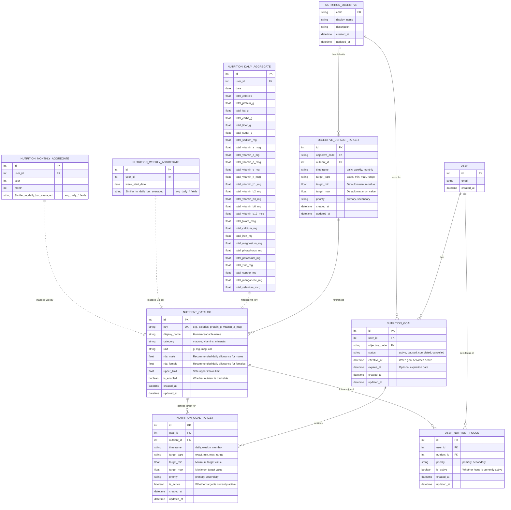

# Nutrition Goals Feature

## Overview

The Nutrition Goals feature allows users to set personalized nutrition objectives and track their daily progress against specific nutrient targets. This feature provides intelligent goal recommendations based on health objectives and real-time progress visualization.

## Scope

### Supported Nutrition Objectives

The feature supports the following nutrition objectives:

1. **Weight Loss Diet** - Balanced nutrition for healthy weight loss
2. **Diabetic Diet ** - Specialized targets for diabetes management
3. **Weight Gain Diet ** - Nutrient targets optimized for healthy weight gain
4. **Therapeutic Diets** - Medical nutrition therapy targets
5. **Diet for Healthy Skin** - Nutrition focused on skin health
6. **Detox Diet** - Cleansing and detoxification nutrition targets

### Key Features

- **Smart Goal Detection**: Automatically detects if user has active nutrition goals
- **Dynamic Progress Visualization**: Real-time progress tracking with color-coded status indicators
- **Priority-based Targeting**: Primary and secondary nutrient classifications
- **Comprehensive Nutrient Tracking**: 25+ nutrients including macros, vitamins, and minerals
- **Flexible Target Types**: Support for exact, minimum, maximum, and range targets
- **Multi-timeframe Support**: Daily, weekly, and monthly goal tracking

### User Experience Flow

1. **No Goal State**: User sees "Set Nutrition Goal" button in nutrition view
2. **Goal Selection**: Modal interface presents objective options with descriptions
3. **Active Goal**: Progress card shows top 5 priority nutrients with real-time progress
4. **Progress Tracking**: Visual feedback on target achievement with status indicators

## Database Schema

The nutrition goals feature uses the following database tables:

### Core Tables

- **`nutrition_objectives`** - Available goal types (weight management, diabetic diet, etc.)
- **`nutrition_nutrient_catalog`** - System-wide catalog of trackable nutrients/vitamins/minerals
- **`nutrition_goals`** - User's active nutrition goals linked to objectives
- **`nutrition_goal_targets`** - Specific nutrient targets per goal with min/max values
- **`user_nutrient_focus`** - User's primary/secondary nutrient priorities

### Data Relationships



## API Endpoints

### Backend API Routes (`/api/v1/nutrition-goals`)

- **GET `/objectives`** - List available nutrition objectives
- **GET `/catalog`** - Get system nutrient catalog (with optional enabled filter)
- **GET `/current`** - Get user's active goal summary
- **GET `/progress/active`** - Get progress vs targets for active goal
- **GET `/defaults/{objective_code}`** - Get default targets for an objective
- **GET `/focus`** - Get user's nutrient focus settings
- **GET `/goals`** - List user's nutrition goals
- **GET `/goals/{goal_id}`** - Get specific goal with targets

### Sample API Responses

#### Active Goal Summary
```json
{
  "has_active_goal": true,
  "goal": {
    "id": 123,
    "objective_code": "weight_management",
    "status": "active",
    "effective_at": "2024-01-01T00:00:00Z"
  },
  "targets_summary": {
    "total": 8,
    "primary": 5,
    "secondary": 3,
    "timeframes": ["daily"]
  }
}
```

#### Progress Response
```json
{
  "objective_code": "weight_management",
  "timeframe": "daily",
  "start_date": "2024-01-15",
  "end_date": "2024-01-15",
  "items": [
    {
      "nutrient_key": "calories",
      "display_name": "Calories",
      "unit": "cal",
      "priority": "primary",
      "target_type": "range",
      "target_min": 1800,
      "target_max": 2200,
      "current_value": 1950,
      "percent_of_target": 0.75,
      "status": "within"
    }
  ]
}
```

## Implementation Details

### Backend (Python/FastAPI)

- **Models**: SQLAlchemy models in `backend/app/models/nutrition_goals.py`
- **Schemas**: Pydantic models in `backend/app/schemas/nutrition_goals.py`
- **CRUD**: Database operations in `backend/app/crud/nutrition_goals.py`
- **API**: Endpoints in `backend/app/api/v1/endpoints/nutrition_goals.py`
- **Migrations**: Alembic migrations `024_add_nutrition_goals_tables.py` and `025_seed_nutrition_catalog.py`

### iOS Frontend (SwiftUI)

- **Models**: Swift models in `apps/Zivohealth/Sources/Models/NutritionGoalsModels.swift`
- **Manager**: API service in `apps/Zivohealth/Sources/Managers/NutritionGoalsManager.swift`
- **Views**: Goal setup in `apps/Zivohealth/Sources/Views/NutritionGoalSetupView.swift`
- **Integration**: Enhanced nutrition view in `apps/Zivohealth/Sources/Views/NutritionView.swift`

### Progress Calculation Logic

The system maps current nutrition data from aggregate tables to goal targets:

1. **Data Retrieval**: Fetch user's aggregated nutrition data for specified timeframe
2. **Target Mapping**: Match nutrient keys between catalog and aggregate columns
3. **Progress Calculation**: Compare current values against target ranges/minimums/maximums
4. **Status Determination**: Classify as "within", "above", "below", or "no_data"
5. **Visualization**: Convert to progress percentages and color-coded indicators

### Status Indicators

- 🟢 **Green (within)**: Current value meets target requirements
- 🟠 **Orange (above)**: Current value exceeds target maximum
- 🔴 **Red (below)**: Current value falls short of target minimum
- ⚪ **Gray (no_data)**: No consumption data available

## Seeded Data

### Default Objectives

The system comes pre-configured with 6 nutrition objectives:

1. `weight_management` - Weight Management Counseling
2. `diabetic_diet` - Diabetic Diet Counseling  
3. `weight_gain_diet` - Weight Gain Diet Counseling
4. `therapeutic_diet` - Therapeutic Diets
5. `healthy_skin_diet` - Diet for Healthy Skin
6. `detox_diet` - Detox Diet

### Nutrient Catalog

25+ nutrients are pre-configured including:

- **Macronutrients**: Calories, Protein, Fat, Carbohydrates, Fiber, Sugar, Sodium
- **Vitamins**: A, C, D, E, K, B1, B2, B3, B6, B12, Folate
- **Minerals**: Calcium, Iron, Magnesium, Phosphorus, Potassium, Zinc, Copper, Manganese, Selenium

## Migration Commands

### Apply Migrations to AWS RDS

```bash
# Connect to EC2 via SSM
aws ssm start-session --target i-0d6b3e920c23c2074

# Run migrations in Docker container
sudo docker compose exec api bash -c "cd /app && PYTHONPATH=/app alembic upgrade 024_add_nutrition_goals_tables"
sudo docker compose exec api bash -c "cd /app && PYTHONPATH=/app alembic upgrade 025_seed_nutrition_catalog"

# Verify migrations
sudo docker compose exec api bash -c "cd /app && PYTHONPATH=/app alembic current"
```

### Local Development

```bash
cd /Users/rajanishsd/Documents/ZivohealthPlatform/backend
source ../venv/bin/activate
export PYTHONPATH=/Users/rajanishsd/Documents/ZivohealthPlatform/backend
ALEMBIC_CONFIG=alembic.ini alembic upgrade 024_add_nutrition_goals_tables
ALEMBIC_CONFIG=alembic.ini alembic upgrade 025_seed_nutrition_catalog
```

## Future Enhancements

- **AI-Powered Recommendations**: Intelligent target suggestions based on user history
- **Social Features**: Goal sharing and community challenges
- **Integration with Wearables**: Automatic sync with fitness trackers
- **Advanced Analytics**: Trend analysis and predictive insights
- **Meal Planning**: Auto-generated meal plans to meet targets
- **Professional Oversight**: Dietitian review and approval workflows

## Technical Notes

- All database connections use SSL/TLS encryption
- RDS authentication tokens are generated dynamically for security
- Progress calculations are performed server-side for consistency
- iOS UI updates automatically when goal status changes
- Migrations are designed to be backwards compatible
- Default targets are based on standard dietary guidelines (RDA/DRI)

---

**Last Updated**: January 2024  
**Version**: 1.0.0  
**Compatibility**: iOS 16.0+, Python 3.11+, PostgreSQL 13+
